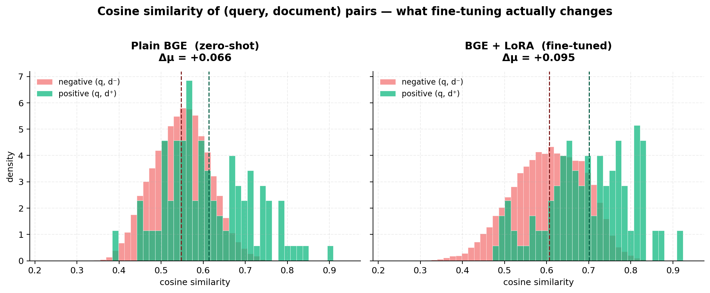
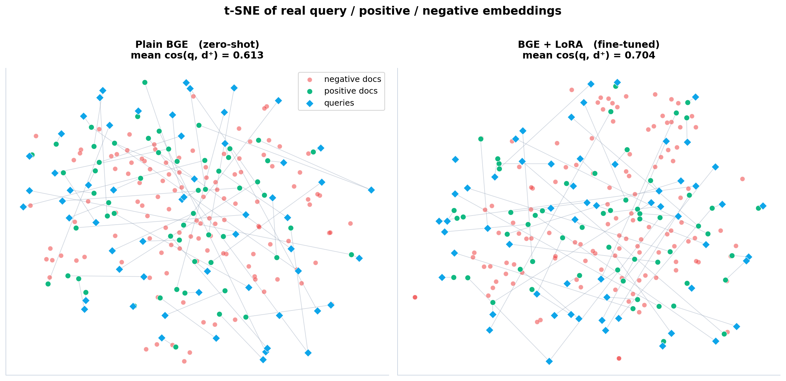
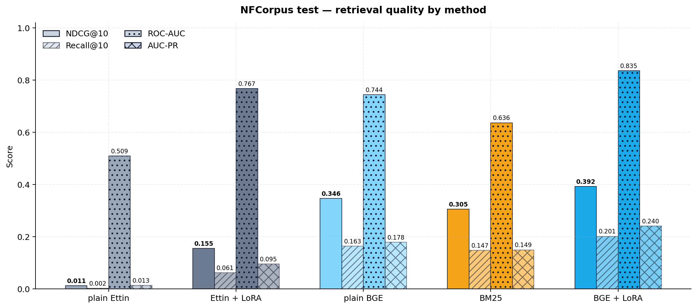
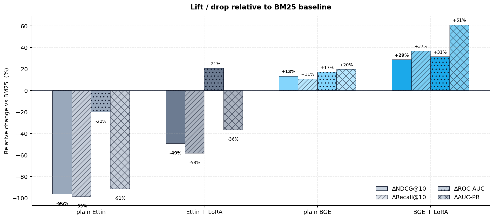
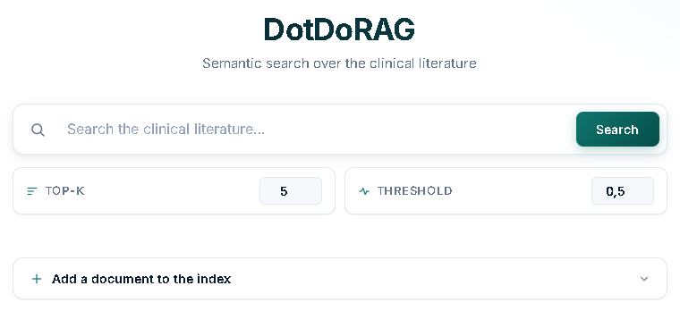
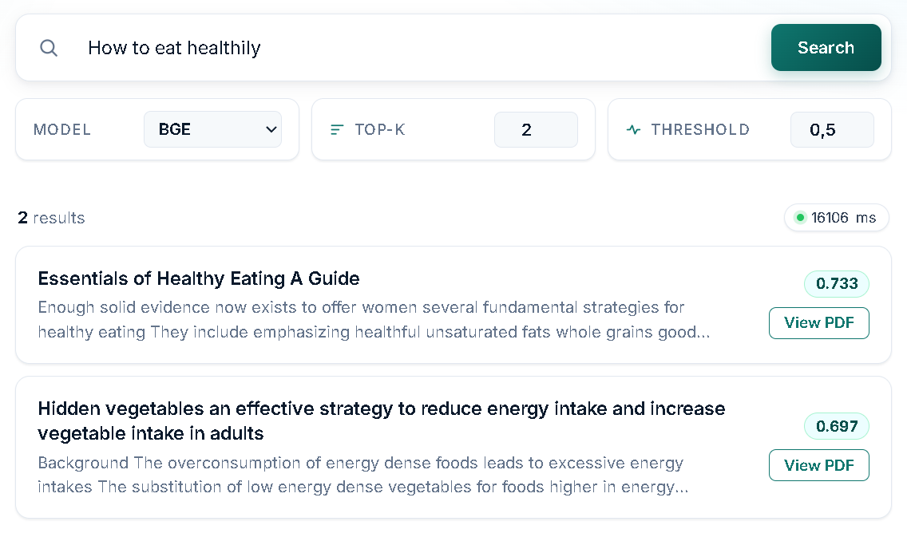
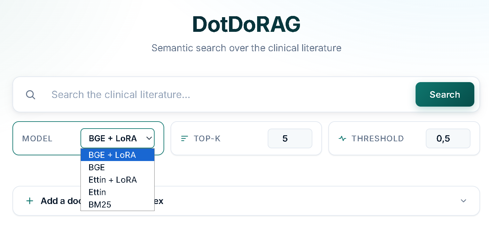
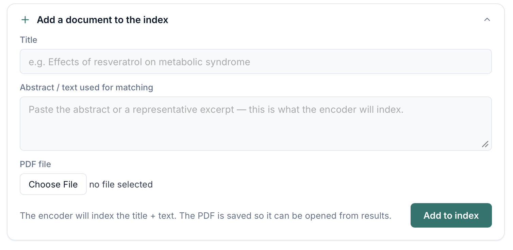

<h1 align="center">DotDoRAG — A LoRA-Tuned Bi-Encoder for Clinical Literature Retrieval</h1>

<p align="center">
  
</p>

<p align="center">
  <em>A semantic search engine for medical and nutritional papers. A pretrained encoder is fine-tuned with LoRA so that queries and the documents that answer them land near each other in vector space, and retrieval at query time is a single matrix multiply against a pre-encoded corpus.</em>
</p>

<p align="center">

  

  

  

  

</p>

---

## TL;DR

> Take a pre-trained transformer encoder, freeze it, attach small LoRA adapters, and train those adapters (with InfoNCE, hard negatives, and teacher distillation) to map queries into the same region of vector space as their relevant documents. Encode the corpus *once*, then search with a single matmul. On NFCorpus this beats BM25 by **+29% NDCG@10** and nearly doubles zero-shot BGE.

**Dataset:** [BEIR / NFCorpus](https://huggingface.co/datasets/BeIR/nfcorpus) — 3,633 medical/nutritional documents, 323 test queries, human-annotated relevance graded 0–2.

---

## Table of contents

1. [Why a bi-encoder](#why-a-bi-encoder)
2. [Architecture overview](#architecture-overview)
3. [Backbones](#backbones)
4. [Role tokens](#role-tokens)
5. [Pooling and normalization](#pooling-and-normalization)
6. [InfoNCE training objective](#infonce-training-objective)
7. [LoRA fine-tuning](#lora-fine-tuning)
8. [Hard negatives and teacher distillation](#hard-negatives-and-teacher-distillation)
9. [Corpus encoding and search](#corpus-encoding-and-search)
10. [Results](#results)
11. [Web UI — DotDoRAG](#web-ui--DotDoRAG)
12. [Reproducing](#reproducing)
13. [Repository layout](#repository-layout)
14. [What's intentionally missing](#whats-intentionally-missing)
15. [Data](#data)

---

## Why a bi-encoder

Four options for *given a query and a corpus, return relevant documents*:

| Approach | Speed | Quality | Notes |
|---|---|---|---|
| BM25 / TF-IDF | Fast | OK | Lexical only, collapses on paraphrase |
| Cross-encoder | Slow | Best | Re-runs the model per (query, doc) pair |
| **Bi-encoder** | **Fast** | **Good** | Encode once offline, matmul at query time |
| Generative RAG | n/a | n/a | Bi-encoder + LLM on top, out of scope here |

Bi-encoder is the right trade-off at this scale: real transformer quality, but the heavy compute moves to a one-time encoding pass.

---

## Architecture overview

```
┌────────────┐                           ┌──────────────┐
│   query    │──► encoder ──► q ────┐    │  doc_vecs    │   pre-encoded
└────────────┘                      │    │  (N × d)     │   once
                                    ▼    └──────┬───────┘
                                 q · D.T        │
                                    │           │
                                    ▼           │
                              top-K cosine  ────┘
                                    │
                                    ▼
                                 results
```

At query time: encode the query once, compute one `(1 × d) @ (d × N)` matmul, sort, threshold. At ~3.6k docs this is sub-millisecond on CPU. For 10⁵+ docs you swap the matmul for FAISS/HNSW; the geometry stays the same.

---

## Backbones

Two encoders were compared, both fine-tuned with LoRA:

- **BGE-small-en-v1.5** (`BAAI/bge-small-en-v1.5`) — ~33M params, already pretrained as a retrieval encoder on hundreds of millions of pairs. Strong zero-shot baseline.
- **Ettin-150M** (`jhu-clsp/ettin-encoder-150m`) — ModernBERT internals (rotary position embeddings, GeGLU, alternating local/global attention). Not pretrained specifically for retrieval, so it is fine-tuned from a more general starting point.

Both are wrapped in a thin `nn.Module` (`src/model.py`) that runs the encoder on (query, positive, negative) batches and returns the first-position hidden state of each.

---

## Role tokens

Bi-encoders see two very different kinds of text: terse queries and long documents. Rather than letting the model infer that distinction from surface form, we tell it explicitly with six special tokens:

```
<QRY> ... </QRY>     for queries
<TLE> ... </TLE>     for titles
<TXT> ... </TXT>     for body text
```

The tokens are added to the tokenizer, the embedding matrix is resized with `resize_token_embeddings`, and the six new rows are randomly initialized. They learn during fine-tuning what each role should mean geometrically.

---

## Pooling and normalization

A variable-length sequence needs to become **one vector**. We use **CLS pooling** (`last_hidden_state[..., 0, :]`) because the contrastive loss trains that slot to act as a summary register.

Then we **L2-normalize**. Two reasons:

1. **Dot product = cosine similarity** when both sides are unit norm: `cos(u, v) = (u · v) / (‖u‖ · ‖v‖) = u · v`. So `que_vec @ doc_vecs.T` *is* the cosine-similarity matrix.
2. **Better geometry.** The loss can only move *directions*, not magnitudes, so the model cannot cheat by inflating "important" vectors.

---

## InfoNCE training objective

For each query, sample one positive `p` from the qrels and `N` negatives `nᵢ`. With temperature `τ`:

$$
\mathcal{L} \=\ -\log \frac{\exp(q \cdot p / \tau)}{\exp(q \cdot p / \tau) + \sum_i \exp(q \cdot n_i / \tau)}
$$

Minimizing this simultaneously pushes `cos(q, p) → 1` (numerator up) and `cos(q, nᵢ) → −1` (denominator down).

The two distributions below show the actual `cos(q, d)` values measured on 120 sampled NFCorpus test queries: paired positives (green) against random negatives (red). The dashed lines mark the means.

<p align="center">
  
</p>

The whole point of the loss is to widen `Δμ = mean(positive sim) − mean(negative sim)`. **Plain BGE gives `Δμ = +0.066`; the LoRA-tuned model gives `Δμ = +0.095`, a 44% increase in the margin that drives ranking.**

**Temperature.** A smaller `τ` sharpens the softmax, amplifying similarity gaps. With **random** negatives we use a gentler `τ = 0.2` (Ettin recipe); with **hard-mined** negatives we drop to `τ = 0.02` (BGE recipe), since even small margins become meaningful.

---

## LoRA fine-tuning

Full fine-tuning of 33M–150M params on 3,633 documents would overfit and overwrite the pretrained weights. **LoRA** freezes the backbone and adds trainable low-rank updates to each linear layer:

$$
y \=\ W x \+\ \frac{\alpha}{r} \cdot (B A)x
$$

- `A ∈ ℝ^{r×d_in}` is Gaussian-init, `B ∈ ℝ^{d_out×r}` is zero-init, so the adapter starts as a **no-op**.
- Empirically, fine-tuning updates `ΔW` tend to be intrinsically low-rank, so rank-16 or rank-32 is sufficient.
- Result: a **~13 MB** `adapter_model.safetensors` instead of a full model checkpoint.

The high learning rate (1e-3) is normal for LoRA — adapters start at zero, only they get updated, and the frozen base cannot be destabilized.

| | **Ettin LoRA** | **BGE LoRA** |
|---|---|---|
| Base model | Ettin-150M | BGE-small (~33M) |
| LoRA rank / α | 16 / 32 | 32 / 32 |
| Target modules | all-linear (Wi, Wo, Wqkv) | query / key / value / dense |
| Temperature `τ` | 0.2 | 0.02 |
| Negatives per query | 8 random | 7 hard + 1 random |
| Teacher distillation | none | KL from BGE-reranker-base |
| Effective batch | 2 | 64 × grad-accum 4 = 256 |
| Epochs | 200 | up to 30, patience 8 |

All hyperparameters live in `src/utils.py` so the recipes can be swapped without touching training code.

---

## Hard negatives and teacher distillation

The BGE recipe stacks two upgrades on top of vanilla InfoNCE:

**Hard negatives.** Random negatives are trivially distinguishable from the positive, so the loss saturates fast and the model never learns fine distinctions. After each epoch, all non-positives are re-ranked by current similarity and the top-K are resampled as hard negatives. The mining logic lives in `src/data.py`.

**Teacher distillation.** A cross-encoder (`BAAI/bge-reranker-base`) scores each (query, candidate) pair. The student's softmax over candidates is trained to match the teacher's via KL divergence:

```
loss = InfoNCE  +  KL_WEIGHT · KL(student_logits || teacher_logits)
```

with `KL_WEIGHT = 2.0`. The student learns *relative* candidate quality, not just "positive vs garbage."

The geometry change shows up clearly in 2-D. Below is a t-SNE of real encoded queries (blue diamonds), their positives (green), and a pool of negatives (red), with each query joined to its positive by a thin line. The annotation reports the **actual** mean cosine similarity `cos(q, d⁺)` in the original embedding space (t-SNE coordinates themselves are not comparable across panels):

<p align="center">
  
</p>

---

## Corpus encoding and search

`src/encode_corpus.py` runs every document through the trained model once, L2-normalizes, and saves:

```
corpus_encoded.pt  =  { doc_vecs: (N × d) tensor,  pdf_paths: [N] }
```

This is the core trade-off of a bi-encoder: one `O(N)` encoding pass up front, then an `O(N·d)` matmul at every query.

`src/search.py`:

```python
que_vec = F.normalize(encoder(query), p=2, dim=1)   # (1, d)
sims    = (que_vec @ doc_vecs.T).squeeze(0)         # (N,)
hits    = [(s, p) for s, p in sorted(zip(sims, paths), reverse=True)
           if s >= threshold]
```

One matmul, one sort, one threshold filter.

---

## Results

NFCorpus test split — **323 queries · 3,633 corpus documents · top-10 evaluation.** Numbers come from `src/eval/eval_compare.py` and are persisted in [`eval_results.json`](eval_results.json). Besides ranking metrics (NDCG@10, Recall@10), each method is scored on **full-corpus ROC-AUC** and **AUC-PR**: per-query binary relevance against the raw similarity scores of all 3,633 documents, macro-averaged over queries.

| Method | Base | Adapter | NDCG@10 | Recall@10 | ROC-AUC | AUC-PR |
|---|---|---|---:|---:|---:|---:|
| **bge_lora** | BGE-small-en-v1.5 | `adapters/bge_lora/` | **0.3923** | **0.2013** | **0.8353** | **0.2401** |
| plain_bge (zero-shot) | BGE-small-en-v1.5 | none | 0.3456 | 0.1631 | 0.7437 | 0.1782 |
| BM25 | n/a | n/a | 0.3052 | 0.1474 | 0.6360 | 0.1491 |
| ettin_lora | Ettin-150M | `adapters/ettin_lora/` | 0.1549 | 0.0615 | 0.7672 | 0.0947 |
| plain_ettin (zero-shot) | Ettin-150M | none | 0.0115 | 0.0019 | 0.5089 | 0.0128 |






**Takeaways**

- Fine-tuned BGE beats BM25 by **+8.7 NDCG points (+29%)** and leads on all four metrics, including **ROC-AUC (+31%)** and **AUC-PR (+61%)**.
- NDCG@10, Recall@10, ROC-AUC, and AUC-PR move together: better representations help both top-*k* ranking and full-corpus discrimination.
- Ettin had no retrieval pretraining; LoRA still produced a large lift, but the quality of the starting checkpoint matters more than any single training trick.
- The starting checkpoint dominates: *plain* BGE (33M params, retrieval-pretrained) beats *trained* Ettin (150M params, generic pretraining) on every metric.

---

## Web UI — DotDoRAG

A Flask wrapper around the same encoder and the same `corpus_encoded.pt`. No new ML, just a UI with the ability to grow the index after training.

### Main page

<p align="center">
  
</p>

Search bar with three controls:

- **Top-K** — maximum number of results to return.
- **Threshold** — minimum cosine similarity to count as a hit.
- **Model** — encoder used for retrieval.

### Searching

<p align="center">
  
</p>

Query → `<QRY>...</QRY>` → encoded → L2-normalized → `que_vec @ doc_vecs.T` → top-K. The score next to each result is raw cosine similarity. The query *"How to eat healthy"* pulls back *"Essentials of Healthy Eating: A Guide"* with only one lexical word in common. That is the encoder doing its job.

### Switching models

<p align="center">
  
</p>

A dropdown lets you switch between available retrieval models. Changing the selection reloads the corresponding adapter, so all subsequent searches run against that model's embedding space. No re-indexing is required as long as the corpus was already encoded with the selected model.

### Adding a document

<p align="center">
  
</p>

Three fields: title, abstract/text (this is what gets indexed; the PDF itself is **not** parsed), and the PDF file. On submit, `/add`:

1. Saves the PDF to `data/nfcorpus/pdf_docs/`.
2. Runs the same encoding path used at build time (`src/indexer.py`).
3. Appends the new vector to the in-memory matrix and persists `corpus_encoded.pt`, under a lock to avoid races.

From the next search onward the document is in the candidate pool. **No retraining required** — the LoRA adapter stays fixed; we simply extend the matrix the query is multiplied against.

---

## Reproducing

```bash
# 1) Install dependencies (CPU works; CUDA / Apple MPS auto-detected)
pip install -r requirements.txt

# 2) Download the NFCorpus dataset (academic/non-commercial use only)
python data/download_data.py

# 3) (optional) Re-train the BGE LoRA adapter
python src/train/train_bge_lora.py

# 3) (optional) Re-train the Ettin LoRA adapter
python src/train/train_ettin_lora.py

# 4) Encode the corpus with the trained adapter
python src/encode_corpus.py

# 5) Run the full evaluation on NFCorpus test
python src/eval/eval_compare.py     # writes eval_results.json

# 6) Regenerate README plots
python src/eval/make_plots.py       # writes plots/*.png

# 7) Launch the web UI
python app/app.py                   # http://127.0.0.1:5050
```

**Adapter weights** are downloaded automatically on first run. The flag `DOWNLOAD_WEIGHTS` in `src/utils.py` controls this behaviour — it is `True` by default, so no manual step is needed. Set it to `False` if you want to load weights from a custom path instead.

Steps 3–4 are optional if you only want to run the UI.

---

## Repository layout

```
app/
  app.py                          Flask application
  templates/                      DotDoRAG UI

src/
  model.py                        Ettin / BGE model wrappers, tokenizers, role tokens
  data.py                         NFCorpusDataset and hard-negative mining
  utils.py                        all hyperparameters and paths (single source of truth)
  encode_corpus.py                one-shot encoding pass → corpus_encoded.pt
  search.py                       CLI search with clickable PDF links
  indexer.py                      encode-and-append helper for the web UI
  train/
    train_bge_lora.py             BGE LoRA with hard negatives and teacher KL distillation
    train_ettin_lora.py           Ettin LoRA with random negatives
  eval/
    eval_compare.py               NDCG@10 / Recall@10 / ROC-AUC / AUC-PR across methods
    make_plots.py                 generates the README figures

adapters/
  bge_lora/                       trained BGE adapter (downloaded automatically on first run)
  ettin_lora/                     trained Ettin adapter (downloaded automatically on first run)

plots/                            generated figures
imgs/                             UI screenshots
requirements.txt                  Python dependencies
corpus_encoded.pt                 pre-encoded corpus { doc_vecs, pdf_paths }
data/
  download_data.py                downloads NFCorpus from the official BEIR source
  nfcorpus/                       NFCorpus data (not in repo, run download_data.py)
eval_results.json                 latest evaluation results
```

---

## What's intentionally missing

- **ANN index** (FAISS / HNSW). Required past ~10⁵ documents, where a plain matmul no longer fits in memory.
- **Cross-encoder reranker** over the top-K. Could close another portion of the gap to the teacher.
- **PDF text extraction.** User-supplied abstracts consistently outperform blind page-1 text slurps.
- **Domain-adaptive pretraining** of Ettin on biomedical text before LoRA. Likely the highest-leverage missing piece.

None of these affect the core pipeline: **encoder → contrastive loss → cached vectors → matmul.** That is the same recipe most production retrieval stacks use.

---

## Data

This project uses the **NFCorpus** dataset for training, evaluation, and the default search corpus.

> Boteva, V., Gholipour, D., Sokolov, A., & Riezler, S. (2016). *A Full-Text Learning to Rank Dataset for Medical Information Retrieval.* ECIR 2016. Heidelberg University StatNLP Group.

**License:** NFCorpus is free to use for **academic and non-commercial purposes only.** For any other use of the NutritionFacts.org-derived content, consult the [NutritionFacts.org terms of service](https://nutritionfacts.org) and contact Dr. Michael Greger directly. See the [original project page](https://www.cl.uni-heidelberg.de/statnlpgroup/nfcorpus/) for the full terms.

Because of these restrictions the dataset is **not bundled in this repository.** Run `python data/download_data.py` to fetch it from the official BEIR distribution; by doing so you accept the upstream terms directly.

---

## References

**Papers**

| | |
|---|---|
| Hu et al., 2022 | [LoRA: Low-Rank Adaptation of Large Language Models](https://arxiv.org/abs/2106.09685) |
| Thakur et al., 2021 | [BEIR: A Heterogeneous Benchmark for Zero-shot Evaluation of Information Retrieval Models](https://arxiv.org/abs/2104.08663) |
| Xiao et al., 2023 | [C-Pack: Packaged Resources To Advance General Chinese Embedding (BGE)](https://arxiv.org/abs/2309.07597) |
| Warner et al., 2024 | [Smarter, Better, Faster, Longer: A Modern Bidirectional Encoder (ModernBERT / Ettin)](https://arxiv.org/abs/2412.13663) |
| van den Oord et al., 2018 | [Representation Learning with Contrastive Predictive Coding (InfoNCE)](https://arxiv.org/abs/1807.03748) |

**Models and datasets on Hugging Face**

| Resource | Link |
|---|---|
| BGE-small-en-v1.5 | [BAAI/bge-small-en-v1.5](https://huggingface.co/BAAI/bge-small-en-v1.5) |
| BGE-reranker-base (teacher) | [BAAI/bge-reranker-base](https://huggingface.co/BAAI/bge-reranker-base) |
| Ettin-encoder-150M | [jhu-clsp/ettin-encoder-150m](https://huggingface.co/jhu-clsp/ettin-encoder-150m) |
| BEIR / NFCorpus dataset | [BeIR/nfcorpus](https://huggingface.co/datasets/BeIR/nfcorpus) |
| PEFT library | [huggingface/peft](https://github.com/huggingface/peft) |

---

## License

MIT &copy; franciszekparma & Johnn2012-y
